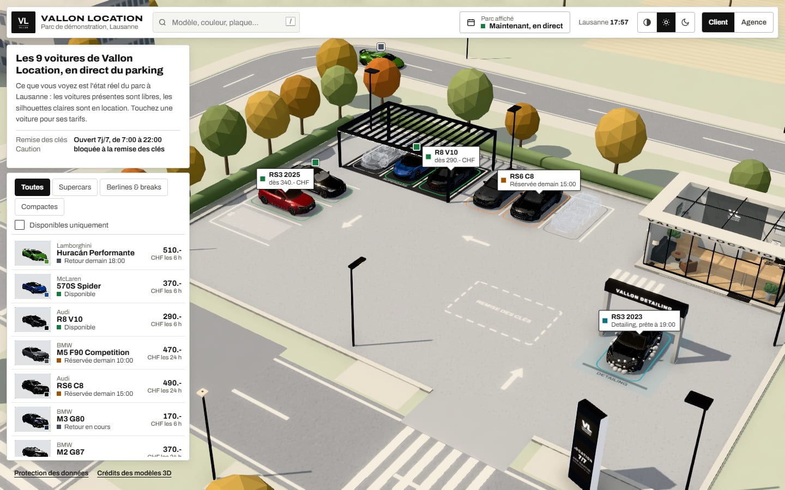
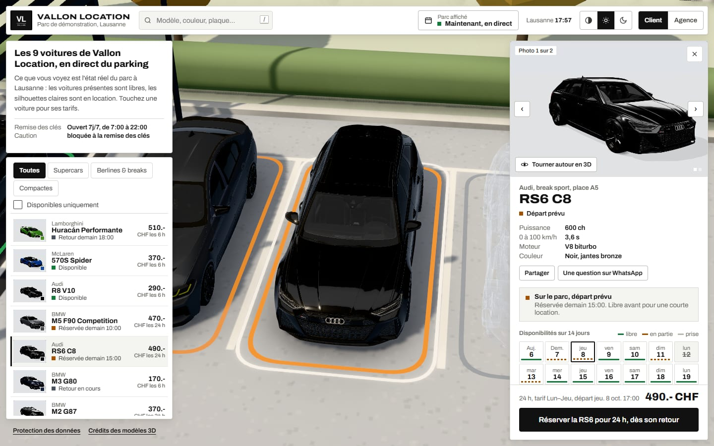
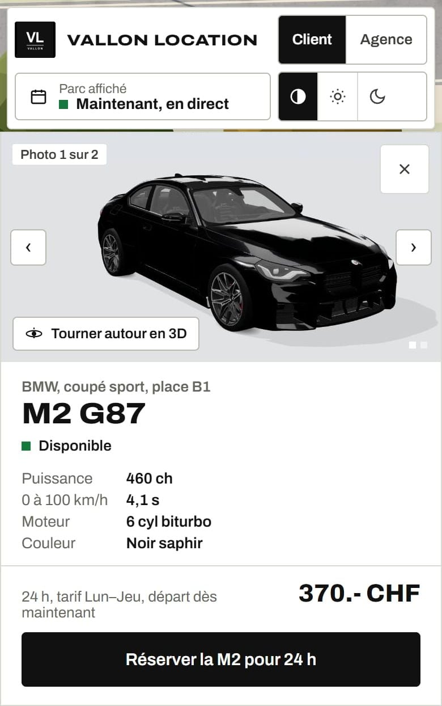
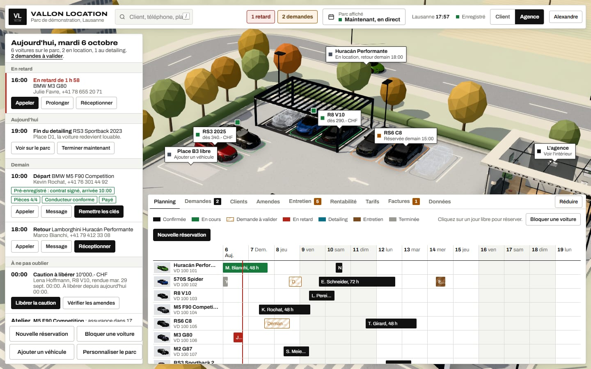
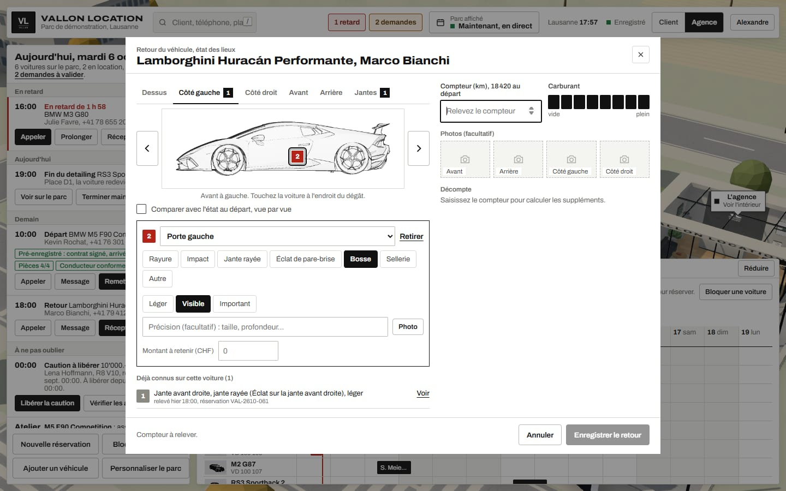
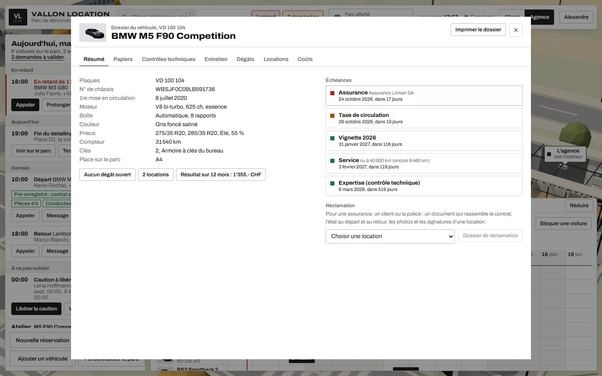
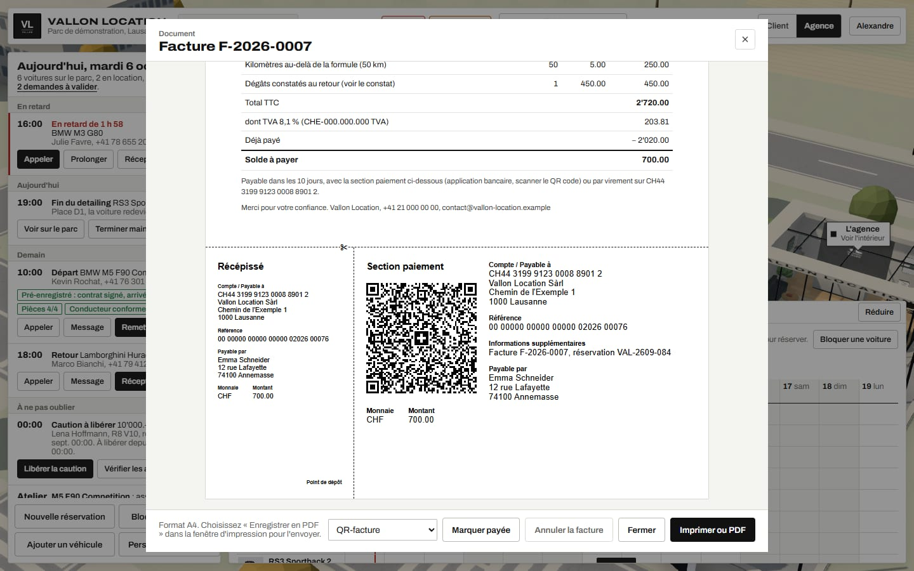

# CALANDRE

Logiciel de gestion pour agences de location de voitures, avec le parc affiché en 3D.

Les clients voient en direct quelles voitures sont libres sur une maquette 3D du parking de l'agence, et réservent
depuis leur téléphone. L'agence gère au même endroit les demandes, les remises de clés, les retours avec état des
lieux, le dossier de chaque voiture, les factures, les amendes et l'entretien.

Le code source est privé. Cette page présente le projet. Les captures montrent une agence fictive, Vallon Location,
avec des réservations et des clients inventés.

## Pour une agence de location

### Le parc en direct

Chaque voiture est à sa vraie place, avec son état : libre, en location, réservée, au
lavage. Une voiture louée laisse une silhouette claire avec son heure de retour. On peut aussi afficher le parc à une
date future pour voir ce qui sera libre. Un clic sur une voiture ouvre sa fiche : photos, tarifs, disponibilités
sur 14 jours, et la réservation.

### La réservation sur téléphone

Le client choisit la voiture, la durée et le kilométrage, renseigne le conducteur
et envoie ses pièces. Le prix et la disponibilité sont calculés par le serveur. Un client déjà venu réserve en
sept touches.

### La journée de l'agence

Départs, retours, retards, demandes à valider, cautions à libérer : tout ce qui demande
une action aujourd'hui est en haut, avec le bon bouton à côté. Le planning sur 14 jours est juste en dessous.

### Les états des lieux sur six vues

Dessus, côtés, avant, arrière et jantes, dessinés à partir du modèle 3D de la
voiture. Un toucher place le dégât, la pièce est reconnue, une photo s'ajoute depuis le téléphone. Au retour, les
dégâts du départ sont affichés à côté. Le client signe le constat sur place ou sur son propre téléphone.

### Le dossier de chaque voiture

Papiers, échéances (assurance, taxe, vignette, expertise), entretien, dégâts,
locations et coûts. En cas de litige, un dossier de réclamation réunit le contrat, les deux états des lieux, les
photos et les signatures.

### Les factures suisses

TVA, numérotation continue et QR-facture, avec les suppléments du retour (kilomètres,
carburant, retard, dégâts) déjà calculés. Rappels automatiques des factures impayées.

### Ajouter une voiture

L'agence saisit la marque, le modèle et l'année. Le logiciel cherche lui-même un modèle 3D
sous licence libre, propose les trois meilleurs, puis le prépare : échelle réelle, roues, teinte exacte de la
carrosserie. La voiture est utilisable tout de suite et apparaît en 3D quand le modèle est prêt.

### Prise en main

Le logiciel s'adresse à des loueurs et des employés qui ne sont pas à l'aise avec l'informatique. Chaque écran a
son aide, avec un bouton « Montre-moi » qui désigne le bon bouton. Chaque action peut être annulée, et ce qui est
supprimé reste 30 jours dans une corbeille. Les boutons sont faits pour le doigt, tout s'enregistre seul, et l'on
peut travailler sans réseau sur un parking mal couvert. Trois rôles : gérant, employé, consultation.

## Côté technique

- **Application** : React 19 et TypeScript, Three.js avec React Three Fiber, Vite. Une seule base de code pour
  ordinateur, tablette et téléphone.
- **3D** : modèles réels préparés par une chaîne maison (glTF-Transform) : mise à l'échelle, ancrage au sol,
  allègement, compression des textures. Les roues sont retrouvées par la géométrie pour tourner et braquer, les
  étriers restent fixes. La carrosserie est repérée pour être recolorée à la teinte de chaque voiture.
- **Vues des états des lieux** : rendu orthographique du modèle 3D, puis détection des contours (profondeur et
  normales) dans un shader, pour obtenir un dessin au trait de chaque face de la voiture.
- **Chargement** : l'écran de chargement ne s'efface que lorsque l'animation est fluide (images régulières mesurées).
  Sur un appareil lent, la 3D passe d'elle-même en mode allégé.
- **Serveur** : Node.js et SQLite (`node:sqlite`). Chaque appareil n'envoie que les champs qu'il a modifiés : deux
  personnes qui changent deux champs d'une même réservation ne s'écrasent pas, un vrai conflit est signalé.
  Journal des actions protégé par la base, corbeille, sauvegardes quotidiennes, export CSV.
- **Comptes** : mots de passe hachés (scrypt), connexion Google, droits vérifiés par le serveur. Les clients n'ont pas
  de compte : ils agissent par le lien secret de leur réservation et ne voient jamais les données des autres.
- **Hors ligne** : copie locale des données, file des changements envoyée au retour du réseau, service worker.
- **Plusieurs agences** : une base commune et un dossier par agence (réglages, flotte, logo, et au besoin des écrans
  remplacés pour elle seule), branché par un plugin Vite. Chaque agence est vérifiée à la compilation.
- **Suisse** : QR-facture (norme SIX, référence QR contrôlée), TVA, protection des données (photos des pièces
  d'identité effacées 12 mois après la dernière location).
- **Tests** : scénarios de bout en bout automatisés dans un vrai navigateur, sur des données séparées : fusion et
  droits, constat signé sur téléphone, facturation, réservation mobile, fonctionnement sans réseau.

## État du projet

Démonstration complète, avec une agence pilote en Suisse romande. Les paiements, les SMS et les messages WhatsApp
sont simulés pour l'instant : les écrans et les parcours sont réels, mais aucune transaction n'a lieu et aucun
message ne part. Interface en français.

## Crédits des modèles 3D

Modèles publiés sur Sketchfab sous licence [CC BY 4.0](https://creativecommons.org/licenses/by/4.0/), allégés et
recolorés pour CALANDRE :

- [2018 Lamborghini Huracán Performante](https://sketchfab.com/3d-models/2018-lamborghini-huracan-performante-c8baa05f1e6d4b89a2c6b5857b7fd13c), par [DisneyCars](https://sketchfab.com/supercarmodels)
- [2018 McLaren 570S Spider](https://sketchfab.com/3d-models/2018-mclaren-570s-spider-a504090e516f44608e35160953b61fcd), par [Ddiaz Design](https://sketchfab.com/ddiaz-design)
- [2020 Audi R8 V10 Coupe](https://sketchfab.com/3d-models/2020-audi-r8-v10-coupe-98b8747ea76f4fc2b75c421001aef20f), par [tonielpro520](https://sketchfab.com/tonielpro520)
- [BMW M5 CS (F90)](https://sketchfab.com/3d-models/bmw-m5-cs-f90-8f74fb3420e24213aaeea33dc99450a3), par [fvrenbld](https://sketchfab.com/890244234)
- [2020 Audi RS 6 Avant](https://sketchfab.com/3d-models/2020-audi-rs-6-avant-dd3fa0ca27ae4b73b89cac131f8d5bac), par [Galaxy Car Showroom](https://sketchfab.com/adrianaflak09)
- [2021 BMW M3 Competition (G80)](https://sketchfab.com/3d-models/2021-bmw-m3-competition-g80-a9027a26b7ee4da4b564d939b6c27559), par [DisneyCars](https://sketchfab.com/supercarmodels)
- [Bmw M2 G87](https://sketchfab.com/3d-models/bmw-m2-g87-cbbc3a1f6bff41abb095f2b90a7bda29), par [kevin (ケビン)](https://sketchfab.com/sohyalebret)
- [2022 Audi RS3 Hatchback](https://sketchfab.com/3d-models/2022-audi-rs3-hatchback-279fe0ed0a8741f1aa55b57ca0aff4ce), par [tonielpro520](https://sketchfab.com/tonielpro520)

Les marques et noms des voitures appartiennent à leurs constructeurs. Vallon Location est une agence fictive.

---

Projet d'Ali, [github.com/Ali213000](https://github.com/Ali213000). Code privé, tous droits réservés.
